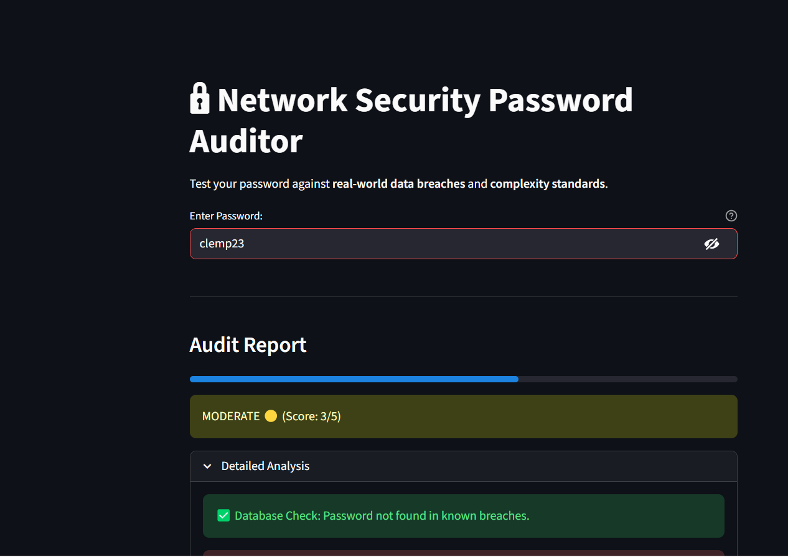

# 🔒 Network Security Password Auditor

### 🔴 [Click Here to Use the Live App](https://password-strength-auditor-lyrd63fyqbd65r5ptebjcn.streamlit.app/)

## 🛡️ Project Overview
A network security tool designed to audit password complexity and check for compromised credentials.

## ⚡ Key Features
- **Breach Detection:** Integrates with the **Have I Been Pwned API** using k-Anonymity (SHA-1 hashing).
- **NIST Compliance:** Analyzes entropy based on length, complexity, and character variety.
- **Privacy-First:** Passwords are hashed locally; only the first 5 characters of the hash leave the client.

## 🛠️ Tech Stack
- **Python** (Logic & Encryption)
- **Streamlit** (Frontend UI)
- **Requests** (API Integration)